<div align="center">

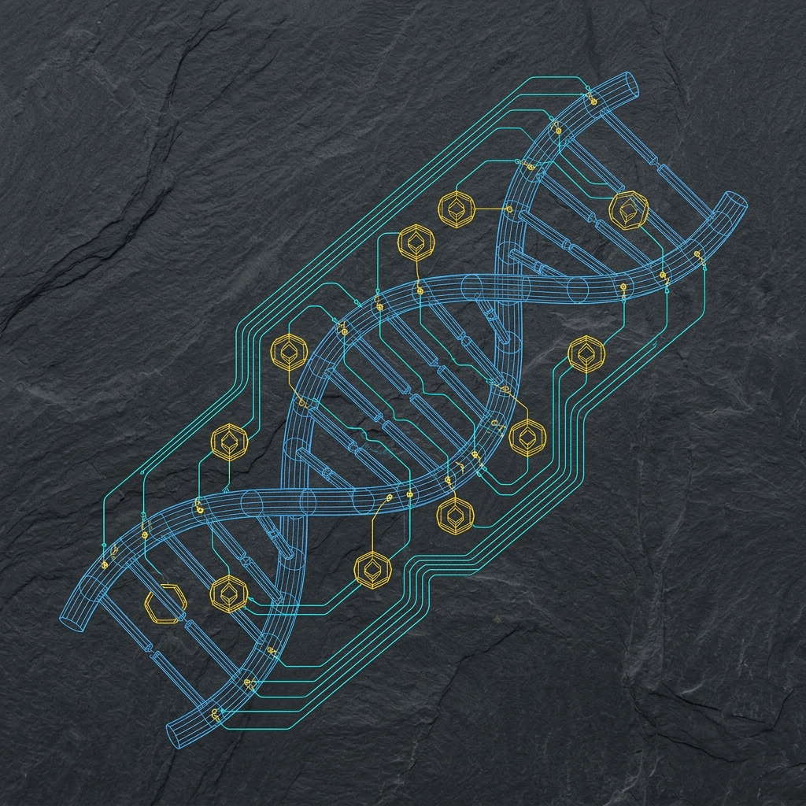

# 🧬 M.U.T.A.T.E.

### **Multi-agent Unsupervised Token Adaptation and Trait Evolution**

*Autonomous A/B Testing and Evolution for Digital Culture & Tokenomics*

[](https://four.meme)
[](https://www.bnbchain.org/)
[](https://ai.google.dev/)
[](LICENSE)

---

> **M.U.T.A.T.E.** deploys a swarm of **15,000+ autonomous AI agents** that utilize evolutionary computation and simulated market pressure to **breed, test, and optimize memecoins** with mathematical precision — before executing a live mainnet deployment.

<br/>

| 🧬 Generations | 🤖 AI Agents | 📊 Signals | ⛓️ Target Chain |
|:---:|:---:|:---:|:---:|
| **50+** evolutionary cycles | **15,000+** autonomous traders | **Multi-signal** hybrid fitness | **BNB Chain** via Four.Meme |

</div>

---

## 📖 Table of Contents

- [The Problem Landscape](#-the-problem-landscape)
- [Architecture Overview](#-the-mutate-architecture)
- [Synthetic Market Swarm](#1-the-synthetic-market-swarm)
- [Multi-Signal Fitness Function](#2-multi-signal-fitness-function)
- [Dual-Engine Evolution](#3-dual-engine-evolution)
- [Real-Time Dashboard](#4-real-time-evolutionary-dashboard)
- [Integration Topology](#-bnb-chain-integration-topology)
- [Quick Start](#-quick-start)
- [Mainnet Graduation](#5-mainnet-graduation)
- [Tech Stack](#-tech-stack)

---

## ⚠️ The Problem Landscape

Current AI agent deployments in decentralized finance rely heavily on historical data or raw human intuition to generate tokens, hitting a **"data wall"** when attempting to create novel cultural artifacts.

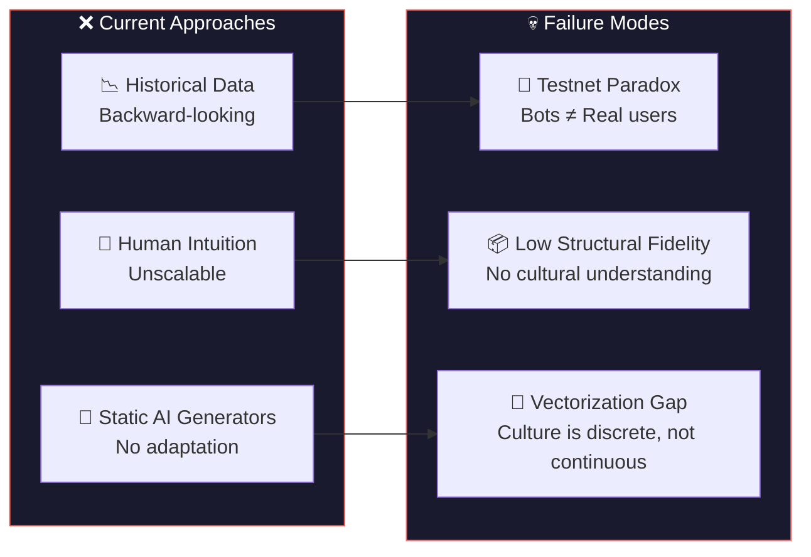

<details>
<summary><b>🔍 Deep Dive: The Three Core Challenges</b></summary>

<br/>

| Challenge | What Goes Wrong | Why It Matters |
|:---|:---|:---|
| **🔁 The Testnet Paradox** | Optimizing tokens with valueless testnet currency produces agents that appeal only to bots — not real users or economic conditions | Market feedback is synthetic and misleading |
| **📦 Structural Fidelity** | High-fidelity simulations (e.g., NASDAQ-like order books) rely on simplistic agents incapable of understanding narrative or culture | Technical accuracy without behavioral realism is useless |
| **📐 Vectorizing Culture** | Cultural resonance is discrete and semantic — not continuous. Gradient descent cannot capture meme virality | You can't `loss.backward()` your way to a good meme |

</details>

---

## 💡 The M.U.T.A.T.E. Architecture

M.U.T.A.T.E. resolves these issues by **decoupling economic optimization from cultural evolution** and replacing testnets with a **high-fidelity synthetic market** powered by LLMs.

### 🏛️ High-Level System Flow

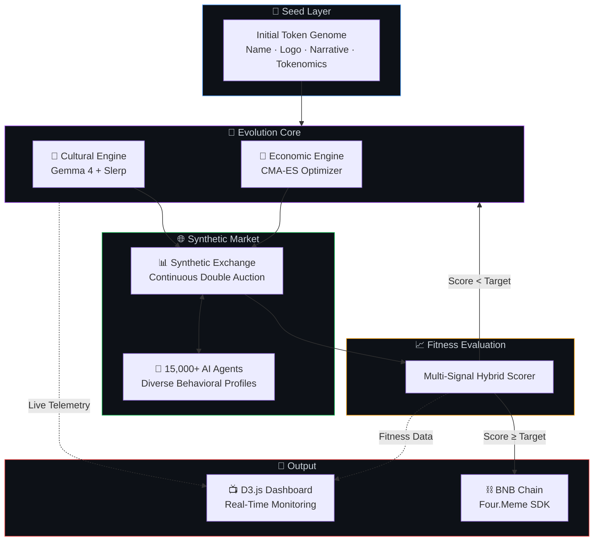

### 🔄 Evolutionary Lifecycle (Per Generation)

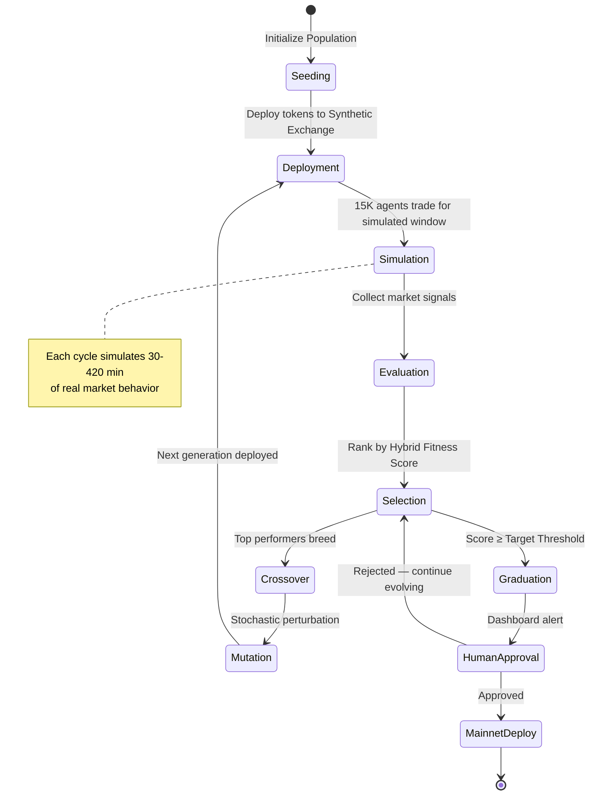

---

### 1. The Synthetic Market Swarm

<div align="center">
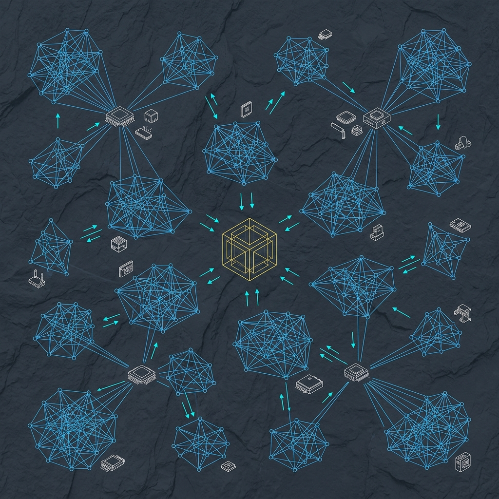
<br/>
<em>Visualization: 15,000+ AI agents with distinct behavioral profiles interacting through a central synthetic exchange</em>
</div>

<br/>

Tokens are deployed into an **off-chain simulated exchange** featuring **nanosecond-resolution continuous double auction** mechanics. The swarm is powered by **Google AI Studio**.

#### 🤖 Agent Taxonomy

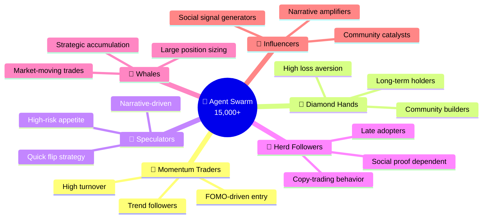

#### Agent Behavioral Dimensions

| Dimension | Range | Impact |
|:---|:---|:---|
| **Loss Aversion** | `0.5 — 3.0` | Sell pressure sensitivity |
| **Herding Coefficient** | `0.0 — 1.0` | Social proof influence |
| **Risk Appetite** | `Conservative → Degen` | Position sizing & entry timing |
| **Narrative Sensitivity** | `Low → High` | Meme/culture responsiveness |
| **Time Horizon** | `Seconds → Weeks` | Hold duration distribution |
| **Information Processing** | `Noise → Signal` | Fundamental vs. hype trading |

---

### 2. Multi-Signal Fitness Function

The system evaluates tokens using a **Hybrid Score** composed of weighted market signals. This avoids gaming any single metric.

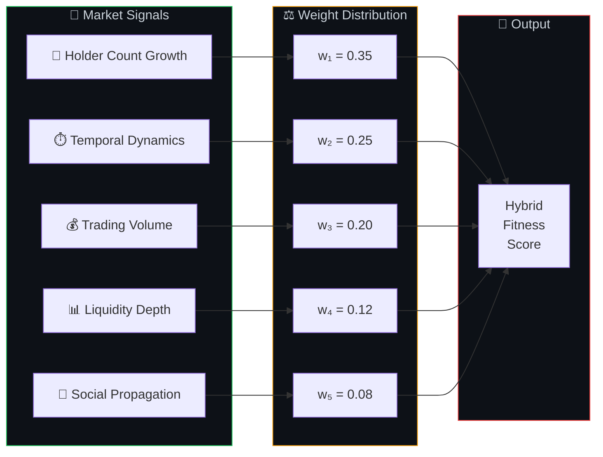

<details>
<summary><b>📐 Fitness Formula Breakdown</b></summary>

<br/>

```
F(token) = w₁·ΔHolders + w₂·TemporalVelocity + w₃·Volume + w₄·LiquidityDepth + w₅·SocialSpread
```

| Signal | Weight | Rationale |
|:---|:---:|:---|
| **Holder Count Growth** | `0.35` | Highest weight — hardest metric to fake. Organic growth = real traction |
| **Temporal Dynamics** | `0.25` | Measures engagement velocity during the critical 30–420 min window |
| **Trading Volume** | `0.20` | Captures sustained economic interest beyond initial hype |
| **Liquidity Depth** | `0.12` | Order book health — shallow depth = fragile market |
| **Social Propagation** | `0.08` | Cross-agent narrative spread — culture is contagious |

</details>

---

### 3. Dual-Engine Evolution

M.U.T.A.T.E. runs **two parallel evolutionary engines** that co-evolve a token's economic parameters and cultural identity simultaneously.

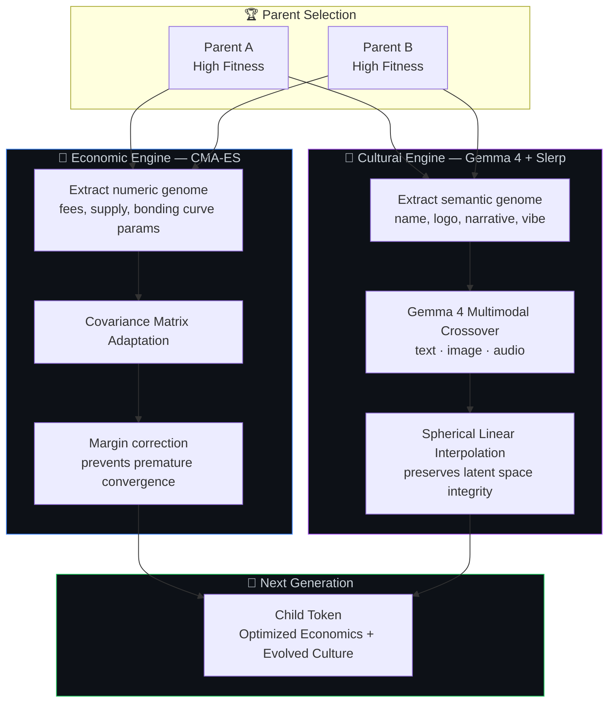

#### Why Two Engines?

| Aspect | 🧮 Economic (CMA-ES) | 🎨 Cultural (Gemma 4 + Slerp) |
|:---|:---|:---|
| **Domain** | Continuous numerical parameters | Discrete semantic artifacts |
| **Genome** | Fees, supply, bonding curves | Name, logo, narrative, vibe |
| **Crossover** | Matrix-weighted recombination | Multimodal semantic blending |
| **Interpolation** | Standard linear | Spherical (Slerp) — preserves manifold geometry |
| **Mutation** | Gaussian noise + margin correction | LLM-guided creative perturbation |
| **Risk** | Premature convergence | Latent space collapse → blurry outputs |
| **Mitigation** | CMA-ES adaptive step sizing | Slerp normalizes on unit hypersphere |

<details>
<summary><b>🔬 Technical: Why Slerp over Lerp?</b></summary>

<br/>

Standard linear interpolation (`Lerp`) in high-dimensional embedding spaces causes vectors to "cut through" the hypersphere, producing semantically invalid midpoints (the "blurry average" problem).

**Spherical Linear Interpolation** (`Slerp`) follows the geodesic on the unit hypersphere surface:

```
Slerp(p₀, p₁, t) = p₀ · sin((1-t)·Ω) / sin(Ω) + p₁ · sin(t·Ω) / sin(Ω)
```

where `Ω = arccos(p₀ · p₁)` is the angle between parent embeddings.

This ensures every interpolated point lies on the semantic manifold, producing culturally coherent offspring rather than noise.

</details>

---

### 4. Real-Time Evolutionary Dashboard

Built with **D3.js**, the dashboard provides live observability into every layer of the evolutionary process.

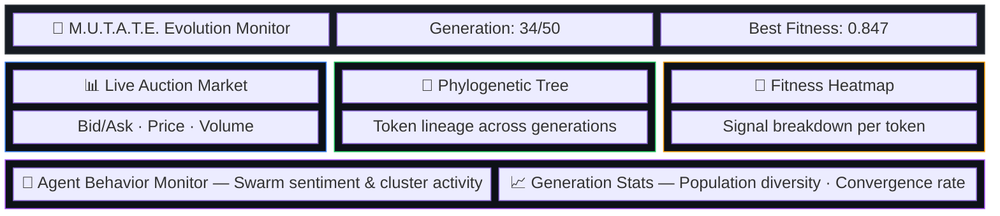

#### Dashboard Views

| Panel | Visualization | Purpose |
|:---|:---|:---|
| **Live Auction** | Real-time candlestick + order book depth | Monitor micro-level token price action |
| **Phylogenetic Tree** | Tidy tree / dendrogram | Track evolutionary lineage across generations |
| **Fitness Heatmap** | Multi-signal heatmap grid | Identify which signals drive top performers |
| **Agent Monitor** | Force-directed graph | Observe swarm sentiment shifts & cluster behavior |
| **Generation Stats** | Line charts + bar charts | Track convergence, diversity, and fitness trajectory |

---

## 🔗 BNB Chain Integration Topology

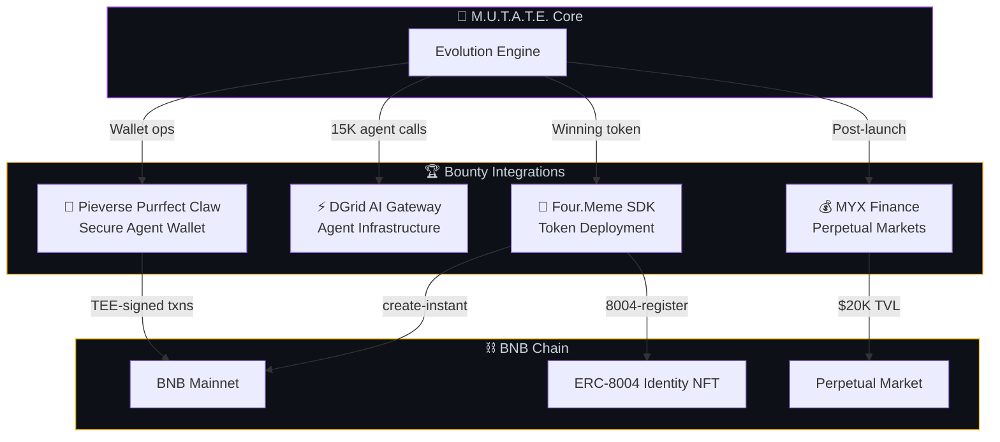

<details>
<summary><b>🔗 Four.Meme SDK — Token Deployment Pipeline</b></summary>

<br/>

Deploys winning tokens to BNB Chain via the Four.Meme API:

```
POST /meme-api/v1/public/user/login    → Authenticate
fourmeme create-instant                 → Deploy token contract
fourmeme 8004-register                  → Mint ERC-8004 identity NFT
```

</details>

<details>
<summary><b>⚡ DGrid AI Gateway — Agent Infrastructure</b></summary>

<br/>

Handles the **15,000+ agent** swarm with:
- Hardware-anchored infrastructure
- Leaderless P2P coordination
- x402 settlement resilience

</details>

<details>
<summary><b>🐾 Pieverse Purrfect Claw — Secure Agent Wallet</b></summary>

<br/>

Secure agent wallet via **TEE (Trusted Execution Environment)**:
- **x402b protocol** for gasless transactions
- Fully auditable payment trail
- Private key never leaves the enclave

</details>

<details>
<summary><b>💰 MYX Finance ($5,000 Bounty) — Perpetual Markets</b></summary>

<br/>

Integrates with the **MYX V2 engine** for post-launch perpetual market activation:
- Minimum **$20,000 TVL** threshold
- Automatic perpetual market creation for graduated tokens

</details>

---

## 🚀 Quick Start

### 1. Clone and Install

```bash
git clone https://github.com/your-org/mutate-agent.git
cd mutate-agent
pip install -r requirements.txt
```

### 2. Environment Configuration

Copy `.env.example` → `.env`

> [!CAUTION]
> **Never commit your `.env` or private keys to version control.**

```env
# LLM & Swarm Infrastructure (Google AI Studio)
GOOGLE_API_KEY=AIzaSy...
DGRID_GATEWAY_URL=https://...

# BNB Chain & Four.Meme Deployment
WALLET_PRIVATE_KEY=0x...
BSC_RPC_URL=https://bsc-dataseed.binance.org/
```

### 3. Run the Synthetic Evolution Sandbox

```bash
python scripts/run_evolution.py --generations 50 --swarm-size 15000
```

### 4. Start the D3.js Dashboard

```bash
cd dashboard && npm install && npm run start
```

Open: 👉 [http://localhost:3000](http://localhost:3000) — Watch your AI swarm evolve memecoins in real time.

---

### 5. Mainnet Graduation

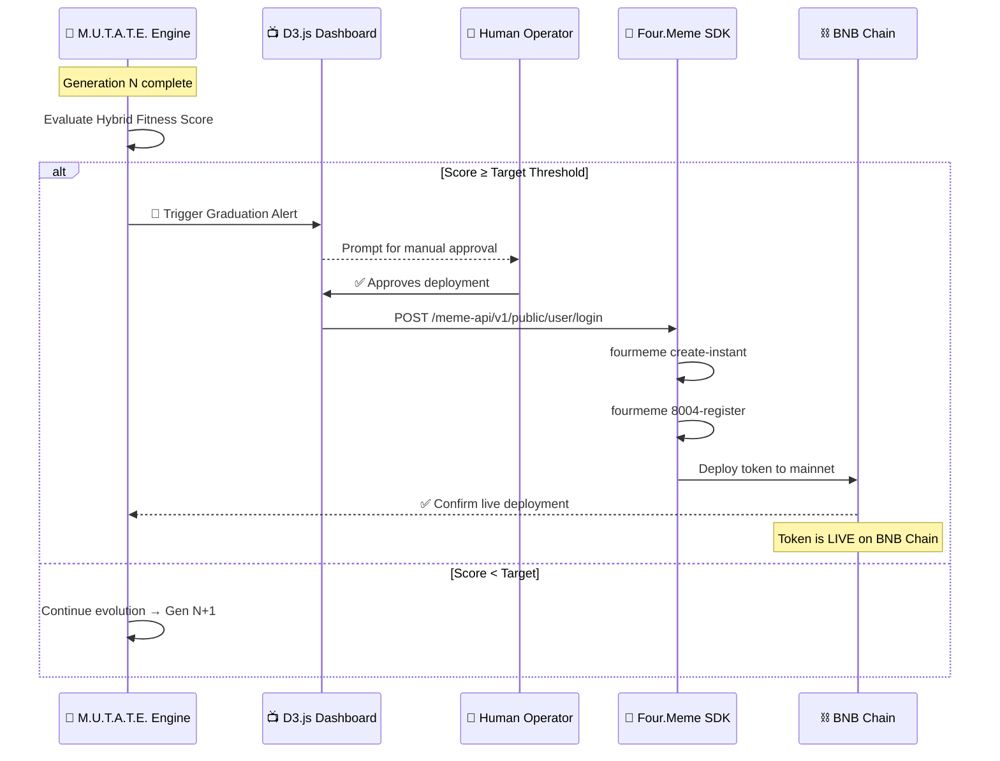

```bash
fourmeme create-instant   # Deploys optimized token to BNB Chain
```

---

## 🛠️ Tech Stack

```mermaid
graph LR
    subgraph AI_Layer ["🧠 AI & Evolution"]
        G4["Gemma 4 Multimodal"]
        CMA["CMA-ES Optimizer"]
        GAS["Google AI Studio"]
    end

    subgraph Infra_Layer ["⚙️ Infrastructure"]
        DG["DGrid AI Gateway"]
        PV["Pieverse TEE Wallet"]
        D3["D3.js Dashboard"]
    end

    subgraph Chain_Layer ["⛓️ Blockchain"]
        FM["Four.Meme SDK"]
        BNB["BNB Chain"]
        MYX["MYX Finance V2"]
    end

    AI_Layer --> Infra_Layer --> Chain_Layer

    style AI_Layer fill:#0d1117,stroke:#4285F4,color:#c9d1d9
    style Infra_Layer fill:#0d1117,stroke:#22c55e,color:#c9d1d9
    style Chain_Layer fill:#0d1117,stroke:#F0B90B,color:#c9d1d9
```

| Layer | Technology | Role |
|:---|:---|:---|
| **AI** | Gemma 4 Multimodal | Cultural crossover, narrative generation, image evolution |
| **AI** | CMA-ES | Numerical tokenomics optimization |
| **AI** | Google AI Studio | LLM inference for 15K agent swarm |
| **Infra** | DGrid AI Gateway | Scalable agent orchestration (P2P, x402) |
| **Infra** | Pieverse Purrfect Claw | TEE-secured wallet operations |
| **Infra** | D3.js | Real-time evolutionary dashboard |
| **Chain** | Four.Meme SDK | Token deployment to BNB Chain |
| **Chain** | BNB Chain | Target mainnet for graduated tokens |
| **Chain** | MYX Finance V2 | Post-launch perpetual market creation |

---

<div align="center">

### Built for the [Four.Meme AI Sprint](https://four.meme) 🧬

*Evolving digital culture, one generation at a time.*

<br/>

[](https://www.bnbchain.org/)
[](https://ai.google.dev/)
[](https://four.meme)

</div>
